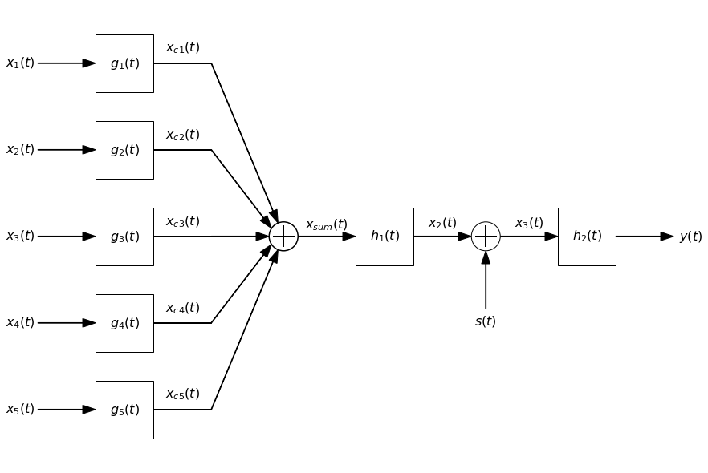
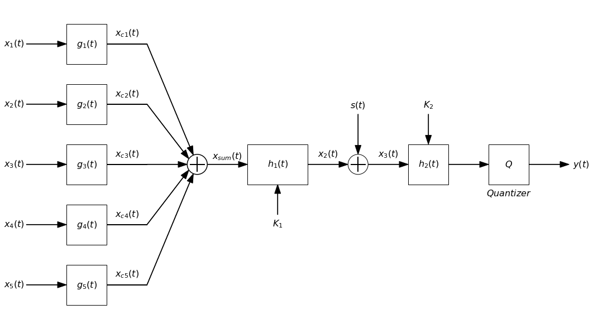

# BlockDiagrams

**BlockDiagrams** is a lightweight Python library for drawing horizontal block diagrams using Matplotlib. It simplifies the visual creation of system and signal diagrams with functions to add blocks, arrows, summation nodes, and multipliers.

v1.2
---

## Features

- Draw rectangular blocks with LaTeX math text.
- Add signal arrows with descriptive labels.
- Include summation and multiplication nodes for system diagrams.
- Horizontal orientation (left to right).
- Easy to use and extend for custom diagrams.
- Automatic or manual position of elements
- Threads for several lines in diagrams.

## New features

v1.2:
- 'block' allows bottom and top inputs.
- 'block' allows center, above or below text.
- 'block' allows linestyles.
- 'block_uparrow' unified within 'block'.
- New get_position() method.

v1.1:
- Threads feature added.
- 'combiner' and 'mult_combiner' modified not to include io arrows.

v1.0:
- Initial version.
---

## Installation

The library is not yet published on PyPI. You can clone the repository directly:

```bash
git clone https://github.com/miguelmartfern/BlockdDagrams.git
```

Then simply import the `BlockDiagrams.py` module into your project.

---

## Basic Usage

```python
from blockdiagrams import DiagramBuilder

db = DiagramBuilder(block_length=1, fontsize=16)

# Dibujo del diagrama
db.add("x(t)", kind="input")
db.add("h_{aa}(t)", kind="block")
db.add("mult", kind="combiner", input_text="p(t)", operation='mult', side='bottom')
db.add("C/D", kind="block_uparrow",input_bottom_text="T_s")
db.add("x_d[n]", kind="arrow")
db.add("h_d[n]", kind="block")
db.add("y_d[n]", kind="arrow")
db.add("D/C", kind="block")
db.add("x_p(t)", kind="arrow")
db.add("h_r(t)", kind="block")
db.add("x_r(t)", kind="output")

#db.show()
db.show(savepath = "diag1.png")
```


---

## More complex examples

```python
from blockdiagrams import DiagramBuilder

db = DiagramBuilder(block_length=1, fontsize=16)

# Dibujo del diagrama
db.add("x(t)", kind="input")
db.add("h_{aa}(t)", kind="block")
db.add("x_c(t)", kind="arrow", length=2)
left_pos = db.get_position()
db.add("mult", kind="combiner", input_text="p(t)", operation='mult', input_side='bottom')
db.add("x_p(t)", kind="arrow")
db.add("C/D", kind="block", input_text="T_s", input_side='bottom')
db.add("x_d[n]", kind="arrow")
db.add("h_d[n]", kind="block")
db.add("y_d[n]", kind="arrow")
db.add("D/C", kind="block")
db.add("y_p(t)", kind="arrow")
db.add("h_r(t)", kind="block")
right_pos = db.get_position()
db.add("x_r(t)", kind="output")

# Calculation of position and size of dashed block h_c(t)
position=(left_pos[0]-0.5,left_pos[1]-0.5)
length=right_pos[0]-left_pos[0]+1
height=2.5
db.add("h_c(t)", kind="block", text=None, text_below="h_c(t)", position=position, length=length, height=height, linestyle='--')

db.show()
```



```python
from blockdiagrams import DiagramBuilder
import numpy as np

db = DiagramBuilder(block_length=1, fontsize=16)

y_pos = np.linspace(3, -3, 5)
x_pos = np.zeros_like(y_pos)
inputs_pos = np.column_stack((x_pos, y_pos))

input_threads = []

# Input branches
for cont in np.arange(inputs_pos.shape[0]):
    thread = "line" + str(cont + 1)
    input_threads.append(thread)

    name = "x_" + str(cont + 1) +"(t)"
    db.add(name, kind="input", thread = thread, position=(inputs_pos[cont]))
    name =  "g_" + str(cont + 1) +"(t)"
    db.add(name, kind="block", thread = thread)
    name = "x_{c" + str(cont + 1) + "}(t)"
    db.add(name, kind="line", thread = thread)

# Adder
db.add("x_{sum}(t)", kind="mult_combiner", inputs=input_threads, position='auto', operation='sum')

# Resto del diagrama
db.add("h_1(t)", kind="block")
db.add("mult", kind="combiner", input_text="s(t)", operation='sum', side='top')
db.add("h_2(t)", kind="block")
db.add("y(t)", kind="output")

db.show(savepath = "diag3.png")
```



---

## Main Functions

- `DiagramBuilder.add(name, kind, position=None, thread='main', **kwargs)`: Adds elements to the diagram.
  - `kind`: `'block'`, `'arrow'`, `'input'`, `'output'`, `'combiner'`, `'mult_combiner'`.
  - `position`: Manual or automatic placement of elements.
  - `text`: LaTeX-formatted text to display inside or near the element.
  - `thread`: branch in diagram.

---

## Upcoming Improvements

- Support for vertical orientation.
- Improved automatic layout and positioning.

---

## Contributing

Contributions are welcome! Please open an issue or pull request on GitHub.

---

## License


This project is licensed under the [MIT License](LICENSE).


---

## Contact

For questions or suggestions, feel free to contact me via GitHub.

---

Thank you for using **blockdiag**!
