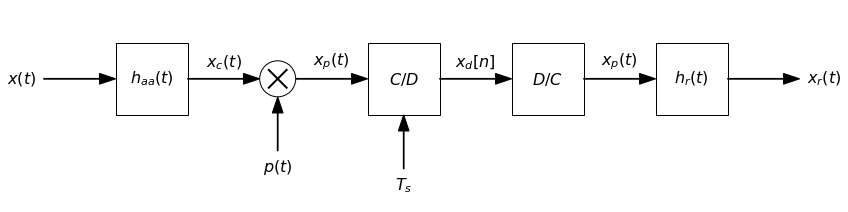
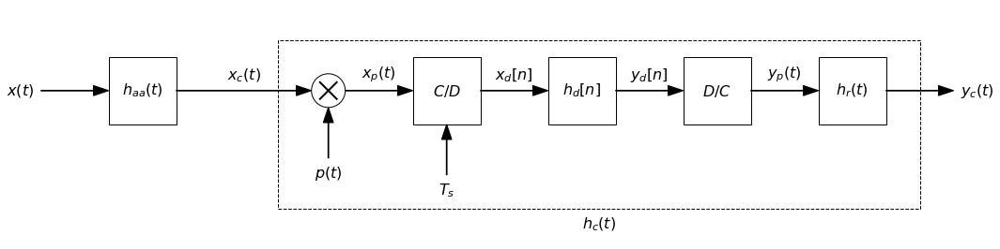
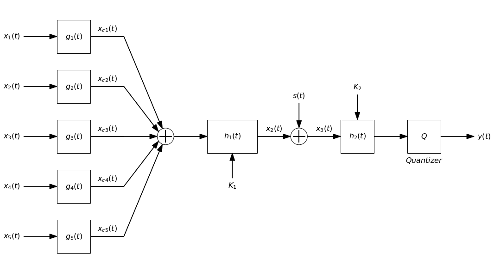
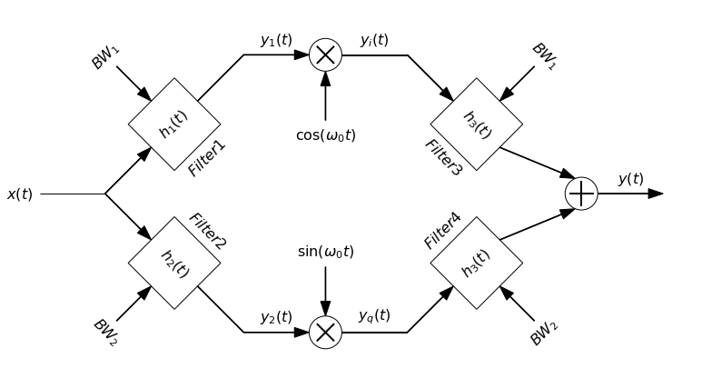
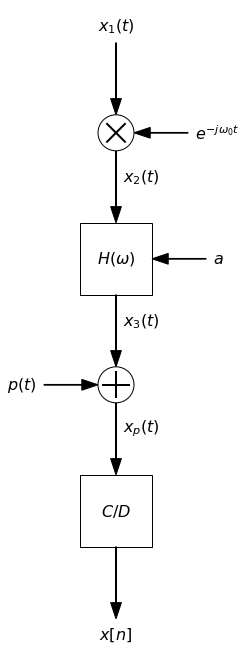

# BlockDiagrams

**BlockDiagrams** is a lightweight Python library for drawing block diagrams with any orientation and several branches using Matplotlib. 

It simplifies the visual creation of system and signal diagrams with functions to add blocks, lines, arrows, summation nodes, and multipliers.

v1.3
---

## Features

- Draw rectangular blocks with LaTeX math text.
- Add signal arrows with descriptive labels.
- Include summation and multiplication nodes for system diagrams.
- Horizontal, vertical (up and down), or any angle orientation.
- Easy to use and extend for custom diagrams.
- Automatic or manual position of elements.
- Threads for several lines in diagrams.

## New features

v1.3:
- Allow for different orientation of elements.
- 'horizontal', 'vertical', 'up', 'down' or any angle.
- For 'vertical', 'up' and 'down' orientations text is mantained horizontal.

v1.2:
- 'block' allows bottom and top inputs.
- 'block' allows center, above or below text.
- 'block' allows linestyles.
- 'block_uparrow' unified within 'block'.
- New get_position() method.

v1.1:
- Threads feature added.
- 'combiner' and 'mult_combiner' modified not to include io arrows.

v1.0:
- Initial version.
---

## Requirements

- Python >= 3.7
- Matplotlib
- NumPy

## Installation

The library is not yet published on PyPI. You can clone the repository directly and execute:

```bash
git clone https://github.com/usuario/blockdiagrams.git
cd blockdiagrams
pip install -e .
```


Then simply import the `BlockDiagrams.py` module into your project.

---

## Basic Usage

```python
from blockdiagrams import DiagramBuilder

db = DiagramBuilder(block_length=1, fontsize=16)

# Diagram drawing
db.add("x(t)", kind="input")
db.add("h_{aa}(t)", kind="block")
db.add("mult", kind="combiner", input_text="p(t)", operation='mult', side='bottom')
db.add("C/D", kind="block_uparrow",input_bottom_text="T_s")
db.add("x_d[n]", kind="arrow")
db.add("h_d[n]", kind="block")
db.add("y_d[n]", kind="arrow")
db.add("D/C", kind="block")
db.add("x_p(t)", kind="arrow")
db.add("h_r(t)", kind="block")
db.add("x_r(t)", kind="output")

#db.show()
db.show(savepath = "diag1.png")
```



---

## More complex examples

```python
from blockdiagrams import DiagramBuilder

db = DiagramBuilder(block_length=1, fontsize=16)

# Diagram drawing
db.add("x(t)", kind="input")
db.add("h_{aa}(t)", kind="block")
db.add("x_c(t)", kind="arrow", length=2)
left_pos = db.get_position()
db.add("mult", kind="combiner", input_text="p(t)", operation='mult', input_side='bottom')
db.add("x_p(t)", kind="arrow")
db.add("C/D", kind="block", input_text="T_s", input_side='bottom')
db.add("x_d[n]", kind="arrow")
db.add("h_d[n]", kind="block")
db.add("y_d[n]", kind="arrow")
db.add("D/C", kind="block")
db.add("y_p(t)", kind="arrow")
db.add("h_r(t)", kind="block")
right_pos = db.get_position()
db.add("x_r(t)", kind="output")

# Calculation of position and size of dashed block h_c(t)
position=(left_pos[0]-0.5,left_pos[1]-0.5)
length=right_pos[0]-left_pos[0]+1
height=2.5
db.add("h_c(t)", kind="block", text=None, text_below="h_c(t)", position=position, length=length, height=height, linestyle='--')

db.show()
```



```python
from blockdiagrams import DiagramBuilder
import numpy as np

db = DiagramBuilder(block_length=1, fontsize=16)

db.add("x_1(t)", kind="input", thread='upper', position=(0, 1))
db.add("mult", kind="combiner", thread='upper', input_text="e^{-j\\omega_0 t}", input_side='top', operation='mult')
db.add("", kind="line", thread='upper')

db.add("x_2(t)", kind="input", thread='lower', position=(0, -1))
db.add("mult", kind="combiner", input_text="e^{j\\omega_0 t}", input_side='bottom', operation='mult', thread='lower')
db.add("", kind="line", thread='lower')


input_threads = ['upper', 'lower']

# Adder
db.add("", kind="mult_combiner", inputs=input_threads, position="auto", operation='sum')

# Rest of the diagram
db.add("H(\\omega)", kind="block")
db.add("z(t)", kind="arrow")
db.add("mult", kind="combiner", input_text="p(t)", input_side = 'bottom', operation='sum')
db.add("x_p(t)", kind="arrow")
db.add("C/D", kind="block")
db.add("x[n]", kind="output")

db.show(savepath = 'diag3.png')
```



```python
from blockdiagrams import DiagramBuilder

db = DiagramBuilder(block_length=1, fontsize=16)

angle = 45

db.add("x(t)", kind="line", text_position='before', thread='upper')

db.add("", kind="arrow", orientation=angle, length = 1, thread='upper')
pos1 = db.get_position(thread='upper')

db.add("h_1(t)", kind="block", orientation=angle, text_below = "Filter1", input_text="BW_1", input_side='top', thread='upper')
db.add("", kind="line", orientation=angle, text_position='above', thread='upper')
db.add("y_1(t)", kind="arrow", text_position='above', thread='upper')
db.add("mult", kind="combiner",  input_text="\cos(\omega_0 t)", operation='mult', input_side='bottom', thread='upper')
db.add("y_i(t)", kind="line", text_position='above', thread='upper')
db.add("", kind="arrow", orientation=-angle, length = 1, thread='upper')
db.add("h_3(t)", kind="block", orientation=-angle, text_below = "Filter3", input_text="BW_1", input_side='top', thread='upper')

db.add("", kind="arrow", orientation=-angle, length = 1, thread='lower', position=pos1)
db.add("h_2(t)", kind="block", orientation=-angle, text_above = "Filter2", input_text="BW_2", input_side='bottom', thread='lower')
db.add("", kind="line", orientation=-angle, text_position='above', thread='lower')
db.add("y_2(t)", kind="arrow", text_position='above', thread='lower')
db.add("mult", kind="combiner",  input_text="\sin(\omega_0 t)", operation='mult', input_side='top', thread='lower')
db.add("y_q(t)", kind="line", text_position='above', thread='lower')
db.add("", kind="arrow", orientation=angle, length = 1, thread='lower')
db.add("h_3(t)", kind="block", orientation=angle, text_above = "Filter4", input_text="BW_2", input_side='bottom', thread='lower')

input_threads = ['upper', 'lower']
db.add("", kind="mult_combiner", inputs=input_threads, position="auto", operation='sum', output_text="y(t)")

db.show(savepath = "block_2_branches.png")
```



```python
from blockdiagrams import DiagramBuilder
import numpy as np

angle = 'vertical'

db = DiagramBuilder(block_length=1, fontsize=16)

db.add("x_1(t)", kind="input", position=(0, 1), orientation = angle)
db.add("mult", kind="combiner", input_text="e^{-j\\omega_0 t}", input_side='top', operation='mult', orientation = angle)
db.add("x_2(t)", kind="arrow", orientation = angle)
db.add("H(\\omega)", kind="block", input_side='top', input_text="a", orientation = angle)
db.add("x_3(t)", kind="arrow", orientation = angle)
db.add("mult", kind="combiner", input_text="p(t)", input_side = 'bottom', operation='sum', orientation = angle)
db.add("x_p(t)", kind="arrow", orientation = angle)
db.add("C/D", kind="block", orientation = angle)
db.add("x[n]", kind="output", orientation = angle)

db.show(savepath = "block_vertical.png")
```



## Additional examples

[Additional examples notebook](Examples/diag_examples.ipynb)

---

## Main Functions

- `DiagramBuilder.add(name, kind, position=None, thread='main', orientation='horizontal', **kwargs)`: Adds elements to the diagram.
  - `kind`: `'block'`, `'arrow'`, `'input'`, `'output'`, `'combiner'`, `'mult_combiner'`.
  - `position`: Manual or automatic placement of elements.
  - `text`: LaTeX-formatted text to display inside or near the element.
  - `thread`: branch in diagram.
  - `orientation`: orientation of element ('horizontal', 'vertical', 'up', 'down', angle).
- `DiagramBuilder.get_position(thread='main')`: Gets actual head position of thread.
  - `thread`: thread you want to get its position (defaults to main thread).

---

## Upcoming Improvements

- Backward elements.
- Feedback loops.

---

## Contributing

Contributions are welcome! Please open an issue or pull request on GitHub.

---

## License


This project is licensed under the [MIT License](LICENSE).


---

## Contact

For questions or suggestions, feel free to contact me via GitHub.

---

Thank you for using **blockdiagram**!
