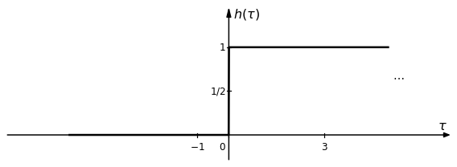
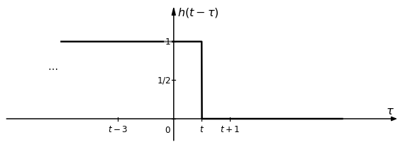
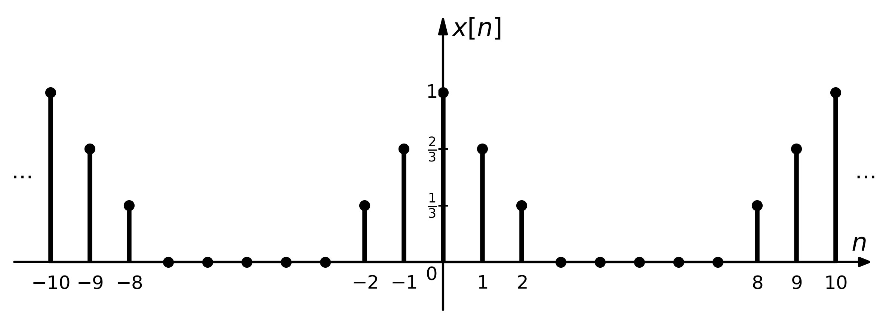
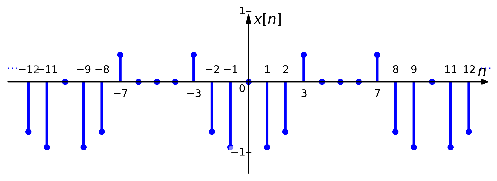
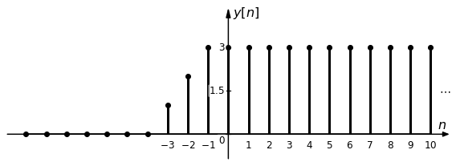

# SignalBlocks

[](https://miguelmartfern.github.io/SignalBlocks/)

**SignalBlocks** is a Python library for visualizing and manipulating signals & systems with high-quality export for publication-quality figures.

Version **2.0** introduces full support for symbolic signal definitions, time-domain operations (shifting, scaling, convolution), and automatic plotting of both continuous and impulsive components. It also maintains backward compatibility with all previous block diagram features.

Version **2.1** allows to represent comple plane poles, zeros, ROCs of Z transforms.

---

## ✨ Main Features

### 🧱 Block Diagram Builder (formerly BlockDiagrams)
- Draw signal processing block diagrams using LaTeX math notation.
- Connect elements via labeled lines, summation and multiplication nodes.
- Support for vertical and angled branches.
- Feedback loops with automatic positioning.

### 📈 Continuous Signal Plotting & Symbolic Operations
- Define signals symbolically: `"x(t)=rect(t-1)"`, `"x(t)=2*delta(t-1)"`, etc.
- Plot continuous-time signals with arrows, units, and impulses.
- Built-in primitives: `rect(t)`, `tri(t)`, `ramp(t)`, `delta(t)`, `u(t)`, `sinc(t)`...
- Combine, scale, delay, flip and modulate signals.
- Convolution visualization: step-by-step and final result.
- Periodic extensions and delta scaling support.

### 📈 Discrete Signal Plotting & Symbolic Operations
- Define signals symbolically: `"x[n]=sin(pi*n/2)"`, `"x[n]=2*delta[n-1]"`, etc.
- Plot discrete-time signals with arrows, units, and discrete impulses.
- Built-in primitives: `rect[n]`, `tri[n]`, `ramp[n]`, `delta[n]`, `u[n]`, `sinc[n]`...
- Combine, scale, delay, flip, decimate and insertion of zeros.
- Convolution visualization: step-by-step and final result.
- Periodic extensions.

### 🔵 Z-Transform Complex Plane Visualization (ComplexPlane)
- Display Z-transform Region of convergence (ROC):
    - Inner disk (|z| < a)
    - Outer disk (|z| > a)
    - Annular regions (a < |z| < b)
- Plot poles and zeros directly in the complex plane.
- Accept both Cartesian (complex numbers) and polar (modulus/angle) coordinates.
- Support for multiplicities: automatically groups multiple poles/zeros at same location.
- Draw unit circle, radial guides, and custom annotations. Automatic label placement with overlap avoidance.

---

## 📦 Installation

```bash
pip install signalblocks
```

Or install locally for development:

```bash
git clone https://github.com/miguelmartfern/SignalBlocks.git
cd SignalBlocks
pip install -e .
```

---

## 📐 Diagram Examples

### Basic Block Diagram

```python
from signalblocks import DiagramBuilder

db = DiagramBuilder(block_length=1, fontsize=16)

# Diagram drawing
db.add("x(t)", kind="input")
db.add("h_1(t)", kind="block")
db.add("x_2(t)", kind="arrow")
db.add("h_2(t)", kind="block")
db.add("y(t)", kind="output")

#db.show()
db.show(savepath = "diag0.png")
```


### More complex diagram Example

```python
from signalblocks import DiagramBuilder

db = DiagramBuilder(block_length=1, fontsize=16)

# Diagram drawing
db.add("x(t)", kind="input")
db.add("h_{aa}(t)", kind="block")
db.add("x_c(t)", kind="arrow", length=2)
left_pos = db.get_position()
db.add("mult", kind="combiner", input_text="p(t)", operation='mult', input_side='bottom')
db.add("x_p(t)", kind="arrow")
db.add("C/D", kind="block", input_text="T_s", input_side='bottom')
db.add("x_d[n]", kind="arrow")
db.add("h_d[n]", kind="block")
db.add("y_d[n]", kind="arrow")
db.add("D/C", kind="block")
db.add("y_p(t)", kind="arrow")
db.add("h_r(t)", kind="block")
right_pos = db.get_position()
db.add("y_c(t)", kind="output")

# Calculation of position and size of dashed block h_c(t)
position=(left_pos[0]-0.5,left_pos[1]-0.5)
length=right_pos[0]-left_pos[0]+1
height=2.5
db.add("h_c(t)", kind="block", text=None, text_below="h_c(t)", position=position, length=length, height=height, linestyle='--')

db.show(savepath = "diag2.png")
```


### Multiple Branches Examples

```python
from signalblocks import DiagramBuilder
import numpy as np

db = DiagramBuilder(block_length=1, fontsize=16)

y_pos = np.linspace(3, -3, 5)
x_pos = np.zeros_like(y_pos)
inputs_pos = np.column_stack((x_pos, y_pos))

input_threads = []

# Input branches
for cont in np.arange(inputs_pos.shape[0]):
    thread = "line" + str(cont + 1)
    input_threads.append(thread)

    name = "x_" + str(cont + 1) +"(t)"
    db.add(name, kind="arrow", thread = thread, text_position='before',position=(inputs_pos[cont]))
    name =  "g_" + str(cont + 1) +"(t)"
    db.add(name, kind="block", thread = thread)
    name = "x_{c" + str(cont + 1) + "}(t)"
    db.add(name, kind="line", thread = thread)

# Adder
db.add("x_{sum}(t)", kind="mult_combiner", inputs=input_threads, 
       position='auto', operation='sum')

# Rest of the diagram
db.add("x_2(t)", kind="arrow")
db.add("h_1(t)", kind="block", input_text="K_1", input_side='bottom', length=1.5)
db.add("x_2(t)", kind="arrow")
db.add("mult", kind="combiner", input_text="s(t)", operation='sum', input_side='top')
db.add("x_3(t)", kind="arrow")
db.add("h_2(t)", kind="block", input_text="K_2", input_side='top')
db.add("", kind="arrow")
db.add("Q", kind="block", text_below='Quantizer')
db.add("y(t)", kind="arrow", text_position='after')

db.show(savepath = "diag3.png")
```


## Different Orientations Example

```python
from signalblocks import DiagramBuilder

db = DiagramBuilder(block_length=1, fontsize=16)

angle = 45

db.add("x(t)", kind="line", text_position='before', thread='upper')
pos1 = db.get_position(thread='upper')

db.add("", kind="arrow", orientation=angle, length = 1, thread='upper')
db.add("h_1(t)", kind="block", orientation=angle, text_below = "Filter1", input_text="BW_1", input_side='top', thread='upper')
db.add("", kind="line", orientation=angle, text_position='above', thread='upper')
db.add("y_1(t)", kind="arrow", text_position='above', thread='upper')
db.add("mult", kind="combiner",  input_text="\cos(\omega_0 t)", operation='mult', input_side='bottom', thread='upper')
db.add("y_i(t)", kind="line", text_position='above', thread='upper')
db.add("", kind="arrow", orientation=-angle, length = 1, thread='upper')
db.add("h_3(t)", kind="block", orientation=-angle, text_below = "Filter3", input_text="BW_1", input_side='top', thread='upper')

db.add("", kind="arrow", orientation=-angle, length = 1, thread='lower', position=pos1)
db.add("h_2(t)", kind="block", orientation=-angle, text_above = "Filter2", input_text="BW_2", input_side='bottom', thread='lower')
db.add("", kind="line", orientation=-angle, text_position='above', thread='lower')
db.add("y_2(t)", kind="arrow", text_position='above', thread='lower')
db.add("mult", kind="combiner",  input_text="\sin(\omega_0 t)", operation='mult', input_side='top', thread='lower')
db.add("y_q(t)", kind="line", text_position='above', thread='lower')
db.add("", kind="arrow", orientation=angle, length = 1, thread='lower')
db.add("h_3(t)", kind="block", orientation=angle, text_above = "Filter4", input_text="BW_2", input_side='bottom', thread='lower')

input_threads = ['upper', 'lower']
db.add("", kind="mult_combiner", inputs=input_threads, position="auto", operation='sum')
db.add("y(t)", kind="output")

db.show(savepath = "block_2_branches.png")
```


### Vertical Diagram Example

```python
from signalblocks import DiagramBuilder
import numpy as np

angle = 'vertical'

db = DiagramBuilder(block_length=1, fontsize=16)

db.add("x_1(t)", kind="input", position=(0, 1), orientation = angle)
db.add("mult", kind="combiner", input_text="e^{-j\\omega_0 t}", input_side='top', operation='mult', orientation = angle)
db.add("x_2(t)", kind="arrow", orientation = angle)
db.add("H(\\omega)", kind="block", input_side='top', input_text="a", orientation = angle)
db.add("x_3(t)", kind="arrow", orientation = angle)
db.add("mult", kind="combiner", input_text="p(t)", input_side = 'bottom', operation='sum', orientation = angle)
db.add("x_p(t)", kind="arrow", orientation = angle)
db.add("C/D", kind="block", orientation = angle)
db.add("x[n]", kind="output", orientation = angle)

db.show(savepath = "block_vertical.png")
```


### Feedback Example

```python
from signalblocks import DiagramBuilder
import numpy as np

db = DiagramBuilder(block_length=1, fontsize=16)

# Diagram drawing
db.add("x(t)", kind="input")
db.add("h_{aa}(t)", kind="combiner", operation="sum", signs=["+", "-"])
# Final position of feedback branch
feedback_position = db.get_position().feedback_pos
db.add("u(t)", kind="arrow")
db.add("h_1(t)", kind="block")
db.add("v(t)", kind="arrow")
db.add("h_2(t)", kind="block")
db.add("y(t)", kind="output", length=1)
# Initial position for feedback branch
pos1=db.element_positions[db.get_current_element()].feedback_pos
# Final position of first feedback arrow
pos2 = pos1+[-2,-1.5]

# Feedback
db.add("y(t)", kind="angled_arrow", position=pos1, final_position=pos2, thread='feedback', first_segment='vertical')
db.add("h_3(t)", kind="block", orientation='left', thread='feedback', input_text="K_3", input_side='top')
# Inital position for second feedback arrow
pos3=db.get_thread_position('feedback')
# pos3=db.get_position().output_pos
db.add("z(t)", kind="angled_arrow", position=pos3, final_position=feedback_position)

db.show(savepath = "feedback_diagram.png")
```


### Additional Examples

[Additional examples notebook 1](docs/notebooks/diag_examples.ipynb)
[Additional examples notebook 2](docs/notebooks/feedback_examples.ipynb)

---

## 📊 Continuous Signal Examples

### Basic Signal Plotting

```python
from signalblocks import SignalPlotter

SignalPlotter("x(t)=rect(t-1)", horiz_range=(-2, 2)).plot()
```


### Impulses and Composition

```python
from signalblocks import SignalPlotter

sp = SignalPlotter()
sp.add_signal("x1(t)=2*delta(t-1)")
sp.add_signal("x2(t)=rect(t)")
sp.add_signal("x3(t)=x1(t) + x2(t)")
sp.plot("x3")
```


### Periodic Signal

```python
from signalblocks import SignalPlotter

sp = SignalPlotter()
sp.add_signal("x(t)=rect(t)", period = 2)
sp.plot("x")
```


### Windowed Cosine

```python
from signalblocks import SignalPlotter
import numpy as np

signal1 = SignalPlotter("x(t)=cos(4 pi t)*tri(t/2)", alpha=0.7, horiz_range=[-3, 3], xticks=np.linspace(-2, 2, 9), color='blue', figsize=(12,4), save_path='signal4.png')
signal1.plot('x')
```


### Piecewise Defined Signal

```python
from signalblocks import SignalPlotter
import numpy as np

signal1 = SignalPlotter(horiz_range=[-2.5, 2.5], xticks=np.linspace(-2, 2, 9), color='blue',save_path='signal5.png')
signal1.add_signal("x(t)=pw((t**2, (t>-1) & (t<0)), (-t, (t>=0) & (t<1)), (0, True))", period=2)
signal1.plot('x')
```


### Sampling Functions

```python
from signalblocks import SignalPlotter
import numpy as np

sp = SignalPlotter(horiz_range=[-5, 5], 
                   xticks=np.linspace(-5, 5, 11), 
                   figsize=(15, 6), 
                   color='red',
                   fraction_ticks=True)
sp.add_signal("x(t)=sinc(t)")
sp.add_signal("p(t)=delta(t-0.5)", period = 1)
sp.add_signal("x_p(t)=x(t) * (1 + p(t))")
sp.plot("x_p")
```


### Frequency Representations

```python
from signalblocks import SignalPlotter
from numpy import pi

sp = SignalPlotter(horiz_range=(-2*pi, 2*pi), 
                   vert_range=(-2, 2),
                   pi_mode=True,
                   xticks_delta=pi/2, 
                   yticks_delta=1,)
sp.add_signal("x1(\omega)=sin(\omega)", label="x_{\\mathrm{base}}(\omega)")
sp.add_signal("x2(\omega)=x1(2*\omega+1)", label="x_{\\mathrm{esc}}(t)")
sp.add_signal("x3(\omega)=x2(-\omega)+x1(\omega-3)", label="x_{\\mathrm{comp}}(\omega)")
sp.plot("x3")
```


### Convolution Examples

```python
from signalblocks import SignalPlotter

sp = SignalPlotter(xticks=[-1, 0, 3], fraction_ticks=True)
sp.add_signal("x(t)=exp(-2t)*u(t)")
sp.add_signal("h(t)=u(t)")
sp.plot_convolution_steps("x", "h", t_val=1)
sp.plot_convolution_view("h(t+tau)", t_val=1, tau='lambda')
sp.plot_convolution_result("x", "h", num_points=100)
```






```python
from signalblocks import SignalPlotter

sp = SignalPlotter(figsize=[16,4], horiz_range=(-10, 10), xticks=[-2, 0, 2], fraction_ticks=True)

sp.add_signal("x(t)=sinc(t)")
sp.add_signal("h(t)=sinc(t/2)")

sp.plot("x")
sp.plot("h")
sp.plot_convolution_result("x", "h", num_points=200)
```


```python
from signalblocks import SignalPlotter

sp = SignalPlotter(horiz_range=(-0, 3), xticks_delta=0.5, fraction_ticks=True)

sp.add_signal("x(t)=exp(-t)*u(t)")
sp.add_signal("h(t)=delta(t-0.5)")
sp.plot_convolution_result("x", "h")
```


### Complex Signals

```python
from signalblocks import SignalPlotter
from numpy import pi

sp = SignalPlotter(
    horiz_range=(-9*pi, 9*pi),
    yticks=[0, 1/5],
    ytick_labels=['0', 'T_s'],
    xticks=[-7*pi, -5*pi, 0, 5*pi, 7*pi],
    pi_mode=True)
sp.add_signal("H_r(\omega)=exp(-j*\omega/4) * pw((1/5, abs(\omega) <= 5*pi), (1/(10*pi)*(7*pi-abs(\omega)), (abs(\omega) > 5*pi) & (abs(\omega) < 7*pi)), (0, True))")
sp.add_signal("H_re(\omega)=re(H_r(\omega))", label="\Re\{H_r(\omega)\}")
sp.add_signal("H_im(\omega)=im(H_r(\omega))", label="\Im\{H_r(\omega)\}")
sp.add_signal("H_abs(\omega)=abs(H_r(\omega))", label="|H_r(\omega)|")
sp.add_signal("H_arg(\omega)=arg(H_r(\omega))", label="\\angle\{H_r(\omega)\}")
sp.plot("H_abs")
```


### Additional Examples

[Additional examples notebook 1](docs/notebooks/signal_examples.ipynb)

## 📊 Discrete Signal Examples

### Basic Signal Plotting

```python
from signalblocks import DiscreteSignalPlotter

dsp = DiscreteSignalPlotter(save_path='discrete_signal1.png')
dsp.add_signal("x[n]=rect(n-1)")
dsp.plot()
```


### Impulses and Composition

```python
from signalblocks import DiscreteSignalPlotter

dsp = DiscreteSignalPlotter(figsize=[16, 4], xticks='auto', horiz_range=(-5, 10), yticks='fit')

dsp.add_signal("x[n]=delta[n+4]")
dsp.add_signal("x2[n]=delta[n-2]+u[n]")
dsp.add_signal("x3[n]=x[n]-x2[n]")
dsp.plot("x3")
```


### Periodic Signal

```python
from signalblocks import DiscreteSignalPlotter

dsp = DiscreteSignalPlotter(horiz_range=(-10, 10), yticks='fit', fraction_ticks=True)

dsp.add_signal("x[n] = tri(n)", period=10)
dsp.plot("x")
```



### Piecewise Defined Signal

```python
from signalblocks import SignalPlotter
import numpy as np

signal1 = SignalPlotter(horiz_range=[-2.5, 2.5], xticks=np.linspace(-2, 2, 9), color='blue',save_path='signal5.png')
signal1.add_signal("x(t)=pw((t**2, (t>-1) & (t<0)), (-t, (t>=0) & (t<1)), (0, True))", period=2)
signal1.plot('x')
```



### Decimation and Zero Insertion

```python
from signalblocks import DiscreteSignalPlotter
import numpy as np

dsp = DiscreteSignalPlotter(horiz_range=(-10, 10), figsize=(10, 4))

dsp.add_signal("x[n] = tri[n]")
dsp.add_signal('x_dec[n]=x[2*n]', label='x_{dec}[n]')
dsp.add_signal('x_ups[n]=x[n/2]', label='x_{ups}[n]')
dsp.zero_insertion("x", factor=2, new_name="x_0ins", label="x_{0ins}[n]")
dsp.plot('x')
dsp.plot('x_dec')
dsp.plot('x_ups')
dsp.plot('x_0ins')

```


### Convolution Examples

```python
from signalblocks import DiscreteSignalPlotter

dsp = DiscreteSignalPlotter(horiz_range=(-10, 10), xticks='auto', figsize=(8, 3))

dsp.add_signal("x[n] = rect(n)")
dsp.add_signal("h[n] = u(n+2)")
dsp.plot_convolution_steps("h", "x", n_actual=2)
dsp.add_signal("y[n]=conv(x[n], h[n])")
dsp.plot('y')
```




### Additional Examples

[Additional examples notebook 1](docs/notebooks/discrete_signal_examples.ipynb)

## 🔵 Z-Transform Complex Plane Visualization Examples

```python
import numpy as np
from signalblocks import ComplexPlane

cp = ComplexPlane(xlim=(-2, 2), ylim=(-2, 2))

poles = [1 + 1j, (1, np.pi/2), 1j, 1 - 1j]
zeros = [0.5 + 0.5j, (0.5, -np.pi/4), 0.5 + 0.5j]

cp.draw_poles_and_zeros(poles=poles, zeros=zeros)
r1 = cp.min_pole_modulus()
r2 = cp.max_pole_modulus()
cp.draw_ROC(f"|z|>{r2}")

cp.draw_radial_guides(labels=["|a|", "|b|"],
                      radii=[r1, r2],
                      angles=None,  # auto-ajuste
                      circles=[True, False])

cp.show(savepath="complex_plane1.png")
```


```python
import numpy as np
from signalblocks import ComplexPlane

cp = ComplexPlane(xlim=(-1.5, 1.5), ylim=(-1.5, 1.5))

poles = [(0.5, np.pi/2), (1.3, -np.pi/2)]
zeros = [(0,0)]

cp.draw_poles_and_zeros(poles=poles, zeros=zeros)

condicion = f"{cp.min_pole_modulus()}<|z|<{cp.max_pole_modulus()}"
print(condicion)

cp.draw_ROC(condicion)

cp.draw_radial_guides(labels=["r_0"],
                      radii=[1/np.sqrt(2)],
                      angles=[-np.pi/6],
                      circles=[True],
                      color='black')

positions = [0.5+0.5j, (np.sqrt(2)/2, np.pi)]
labels = ['1/2+1/2j', '-\sqrt{2}/2']

cp.label_positions(positions, labels)

cp.draw_unit_circle(color='green', linestyle=':', linewidth=3)

cp.show("complex_plane2.png")
```


---

## 🔧 API Overview

### `DiagramBuilder`
- `add(...)`: Add blocks, arrows, summing nodes, etc.
- `show(...)`: Display or save the diagram.
- `get_position(...)`, `get_thread_position(...)`: Query positions.

### `SignalPlotter`
- `add_signal(...)`: Add a symbolic signal definition.
- `plot(...)`: Plot a single signal.
- `plot_convolution_steps(...)`: Visualize `x(τ)`, `h(t−τ)`, etc.
- `plot_convolution_result(...)`: Plot the result of convolution.
- `plot_convolution_view(...)`: Show intermediate signals like `x(t−τ)`.

### `DiscreteSignalPlotter`
- `add_signal(...)`: Add a symbolic signal definition.
- `plot(...)`: Plot a single signal.
- `plot_convolution_steps(...)`: Visualize `x[k]`, `h[n-k]`, etc.
- `plot_convolution(...)`: Plot the result of convolution.
- `convolution_anim(...)`: Plot an animation of convolution.

### `ComplexPlane`
- `draw_poles_and_zeros(...)`: Plot poles (×) and zeros (○), supporting multiplicity.
- `draw_ROC(...)`: Draw Region of Convergence with conditions like |z|<a, |z|>a, or a<|z|<b.
- `draw_radial_guides(...)`: Add radial lines with labels and optional dashed circles.
- `label_positions(...)`: Add custom labels at arbitrary positions (complex or polar coordinates).
- `draw_unit_circle(...)`: Draw the unit circle (|z|=1).
- `show(...)`: Display or save the complex plane figure.

---

## 🕰️ Version History

### v2.2
- New module `DiscreteSignalPlotter` with symbolic discrete signal representation.
- Convolution support.
- Time-domain transformations: shift, scale, reflect, decimation, insertion of zeros.

### v2.1.1
- plot_contolution_results() rewritten with optimized performance and better support estimation.

### v2.1.0
- New module `ComplexPlane` for Z-Transform Complex Plane Visualization.
- ROC, poles, zeros, unit circle, ...

### v2.0.0 (renamed as SignalBlocks)
- New module `SignalPlotter` with symbolic continuous signal representation and plotting.
- Convolution support (including impulses).
- Time-domain transformations: shift, scale, reflect.
- Maintains all features from v1.x of DiagramBuilder.

### v1.4.1 and earlier (BlockDiagrams)
- See legacy README at [v1.4.1](https://github.com/miguelmartfern/SignalBlocks/tree/v1.4.1).

---

## Upcoming Improvements

- Complete refactory for discrete and continuous signal representation and operation.

---

## 📄 License

This project is licensed under the [GNU GPL v3.0 or later](LICENSE).

---

## 🙋 Contact

Maintained by **Miguel Á. Martín-Fernández** · [migmar@uva.es](mailto:migmar@uva.es) · [GitHub](https://github.com/miguelmartfern/SignalBlocks)
