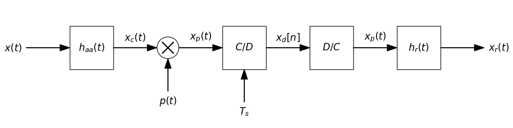

# BlockDiagrams

**BlockDiagrams** is a Python library for drawing signal processing and control system block diagrams using Matplotlib.

Developed by [Miguel Á. Martín-Fernández](https://github.com/miguelmartfern), the goal of this package is to make it easy to create publication-ready block diagrams with a minimal and intuitive API.

---

## 🚀 Installation

You can install the library using `pip` (once published):

```bash
pip install blockdiagrams
```

If you're working locally with the repository:

```bash
pip install -e .
```

---

## 📦 Features

- Draw basic blocks, summing junctions, arrows, and multipliers
- Horizontal/vertical or any angle layout support
- Customizable labels and positions
- Easy integration with Jupyter notebooks
- Thread for several lines in diagrams
- Feedback branches

---

## 🧰 Basic Example

```python
from signalblocks import DiagramBuilder

db = DiagramBuilder(block_length=1, fontsize=16)

# Diagram drawing
db.add("x(t)", kind="input")
db.add("h_{aa}(t)", kind="block")
db.add("x_c(t)", kind="arrow")
db.add("mult", kind="combiner", input_text="p(t)", operation='mult', input_side='bottom')
db.add("x_p(t)", kind="arrow")
db.add("C/D", kind="block", input_text="T_s", input_side='bottom')
db.add("x_d[n]", kind="arrow")
db.add("D/C", kind="block")
db.add("x_p(t)", kind="arrow")
db.add("h_r(t)", kind="block")
db.add("x_r(t)", kind="output")

#db.show()
db.show(savepath = "diag1.png")
```

This will generate a basic sample and interpolation diagram.



---

## 🧰 Additional examples

[Additional examples notebook 1](notebooks/diag_examples.ipynb)
[Additional examples notebook 2](notebooks/feedback_examples.ipynb)

## 📚 Documentation

See the [API Documentation](reference.md) for full reference of all available drawing functions and parameters.

---

## 🛠️ Contributing

Feel free to open issues or pull requests on [GitHub](https://github.com/miguelmartfern/BlockDiagrams) if you'd like to contribute or report bugs.

---

## 📄 License

This project is licensed under the [MIT License](https://github.com/miguelmartfern/BlockDiagrams/blob/main/LICENSE).
