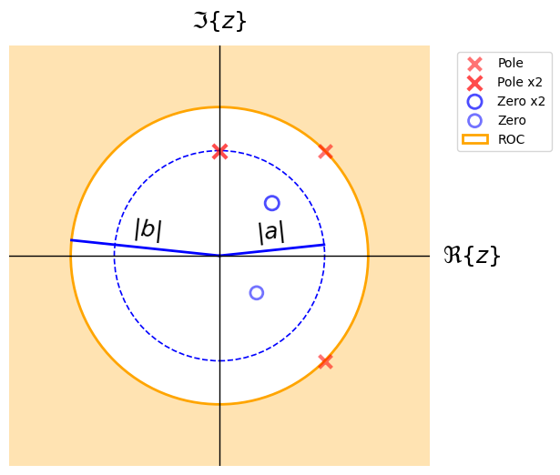

# SignalBlocks

**SignalBlocks** is a Python library for visualizing and manipulating signals & systems.

Developed by [Miguel Á. Martín-Fernández](https://github.com/miguelmartfern), the goal of this package is to make it easy to create publication-ready block diagrams and plot symbolic signal definitions and combinations, including time-domain operations (shifting, scaling, convolution) and complex plane Z-Transform ROC representations with a minimal and intuitive API.

---

## 🚀 Installation

You can install the library using `pip` (once published):

```bash
pip install signalblocks
```

If you're working locally with the repository:

```bash
pip install -e .
```

---

## 📦 Features

- Create and draw block diagrams:
    - Draw basic blocks, summing junctions, arrows, and multipliers
    - Horizontal/vertical or any angle layout support
    - Customizable labels and positions
    - Easy integration with Jupyter notebooks
    - Thread for several lines in diagrams
    - Feedback branches
- Define and plot signals:
    - Typical signals: steps, deltas, rect, tri, sinc, ramp, ...
    - Piecewise signals.
    - Periodic signals support.
    - Time shift operations.
    - Signal combinations.
    - Time sampling support.
    - Convolutions with intermediate signals plot.
- Z-Transform Complex Plane Visualization (ComplexPlane)
    - Display Z-transform Region of convergence (ROC):
        - Inner disk (|z| < a)
        - Outer disk (|z| > a)
        - Annular regions (a < |z| < b)
    - Plot poles and zeros directly in the complex plane.
    - Accept both Cartesian (complex numbers) and polar (modulus/angle) coordinates.
    - Support for multiplicities: automatically groups multiple poles/zeros at same location.
    - Draw unit circle, radial guides, and custom annotations. Automatic label placement with overlap avoidance.

---

## 🧰 Block Diagram Basic Example

```python
from signalblocks import DiagramBuilder

db = DiagramBuilder(block_length=1, fontsize=16)

# Diagram drawing
db.add("x(t)", kind="input")
db.add("h_{aa}(t)", kind="block")
db.add("x_c(t)", kind="arrow")
db.add("mult", kind="combiner", input_text="p(t)", operation='mult', input_side='bottom')
db.add("x_p(t)", kind="arrow")
db.add("C/D", kind="block", input_text="T_s", input_side='bottom')
db.add("x_d[n]", kind="arrow")
db.add("D/C", kind="block")
db.add("x_p(t)", kind="arrow")
db.add("h_r(t)", kind="block")
db.add("x_r(t)", kind="output")

#db.show()
db.show(savepath = "diag1.png")
```

This will generate a basic sample and interpolation diagram.


---

## 🧰 Additional examples

[Additional examples notebook 1](notebooks/diag_examples.ipynb)
[Additional examples notebook 2](notebooks/feedback_examples.ipynb)

## 📊 Signal Basic Example

```python
from signalblocks import SignalPlotter

sp = SignalPlotter()
sp.add_signal("x1(t)=2*delta(t-1)")
sp.add_signal("x2(t)=rect(t)")
sp.add_signal("x3(t)=x1(t) + x2(t)")
sp.plot("x3")
```

This will generate a basic signal with a shifted Dirac Delta and a rect.


## 📊 Additional examples

[Additional examples notebook 1](notebooks/signal_examples.ipynb)

## 🔵 Z-Transform Complex Plane Visualization Examples

```python
import numpy as np
from signalblocks import ComplexPlane

cp = ComplexPlane(xlim=(-2, 2), ylim=(-2, 2))

poles = [1 + 1j, (1, np.pi/2), 1j, 1 - 1j]
zeros = [0.5 + 0.5j, (0.5, -np.pi/4), 0.5 + 0.5j]

cp.draw_poles_and_zeros(poles=poles, zeros=zeros)
r1 = cp.min_pole_modulus()
r2 = cp.max_pole_modulus()
cp.draw_ROC(f"|z|>{r2}")

cp.draw_radial_guides(labels=["|a|", "|b|"],
                      radii=[r1, r2],
                      angles=None,  # auto-ajuste
                      circles=[True, False])

cp.show(savepath="complex_plane1.png")
```



## 📚 Documentation

See the [API Documentation](reference.md) for full reference of all available drawing functions and parameters.

---

## 🛠️ Contributing

Feel free to open issues or pull requests on [GitHub](https://github.com/miguelmartfern/SignalBlocks) if you'd like to contribute or report bugs.

---

## 📄 License

This project is licensed under the [GNU GPL v3.0 or later](https://github.com/miguelmartfern/SignalBlocks/blob/main/LICENSE).
